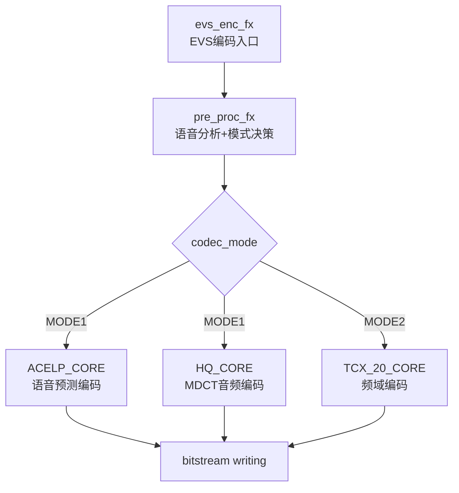
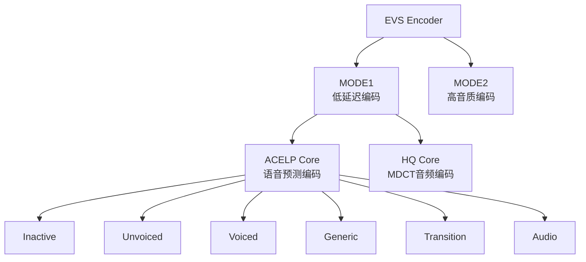
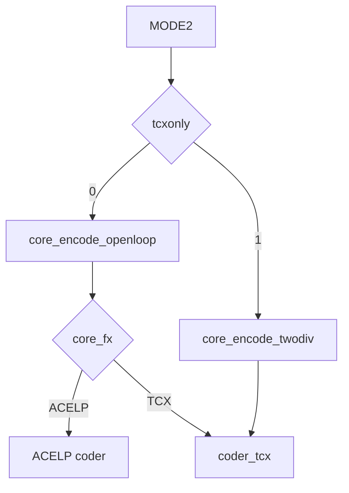
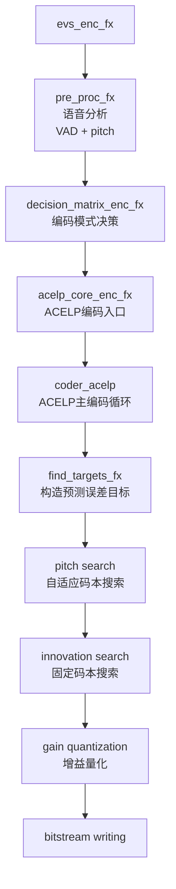
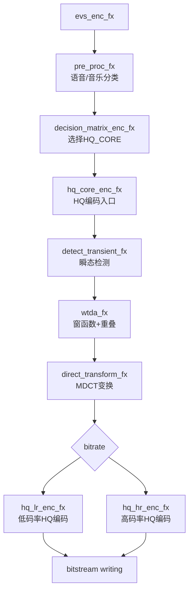
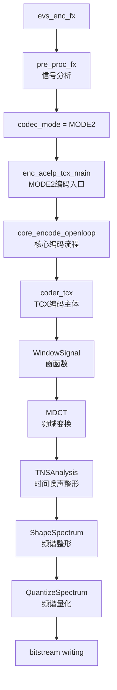
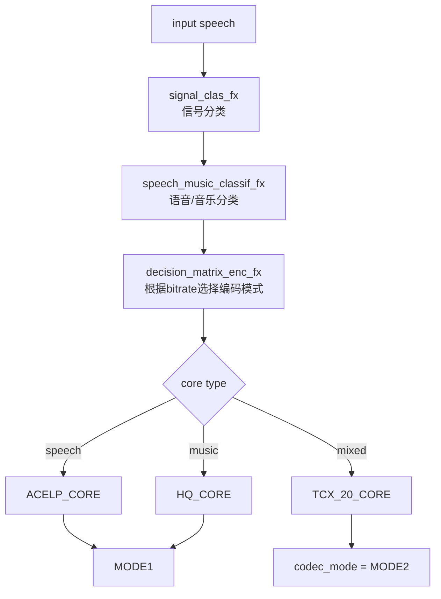
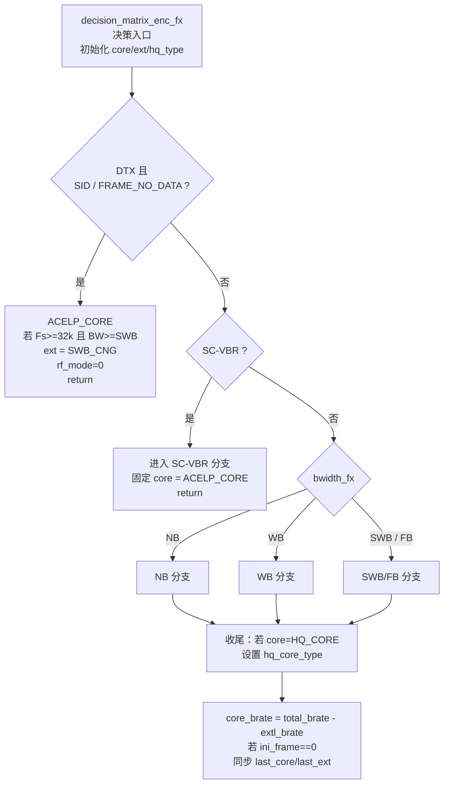
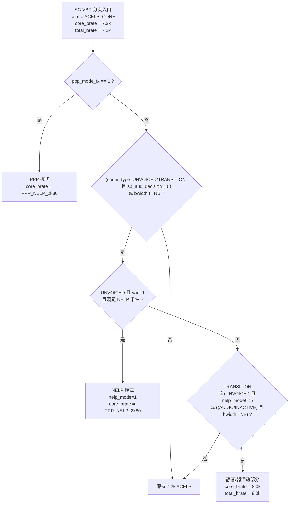
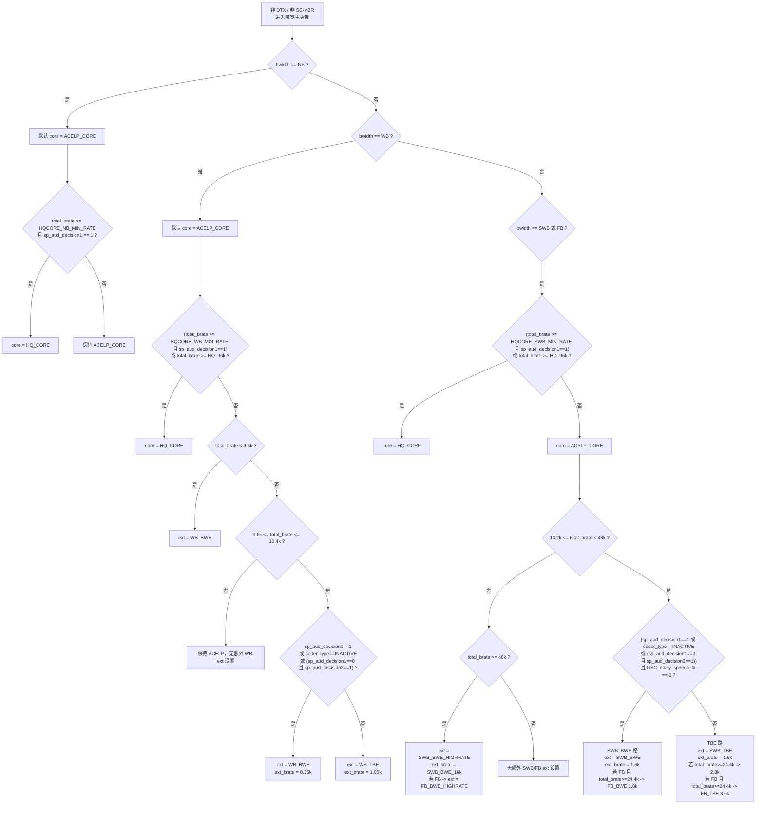

# 1. EVS 总体结构
EVS Encoder 每帧先做信号分析，然后在 MODE1(ACELP/HQ) 或 MODE2(TCX) 之间选择编码路径。

# 2. Model=1, ACELP call chain
ACELP 是典型 analysis-by-synthesis 编码结构，通过 pitch codebook + innovation codebook 组合重建语音。

, 
# 3. MODE=1 MDCT/HQ Call chain
HQ 编码类似 AAC 的 MDCT 结构，适合音乐类信号。

# 4. MODE=2 TCX call chain
TCX 是 ACELP 与 HQ 之间的过渡编码模式，兼顾语音和音乐质量。
TCX 是 EVS 的 transform coder。

# 5. Mode Switch
EVS 的核心是 signal-driven codec switching，根据信号类型和码率动态选择编码模式。

# decision matrix switch
1. 如果是

# SC-VBR 完整决策树

# 主决策树

sharpFlag是个什么标志，为啥在preproces做了多次判断？