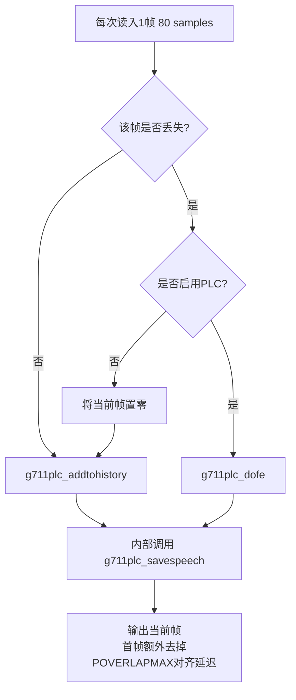
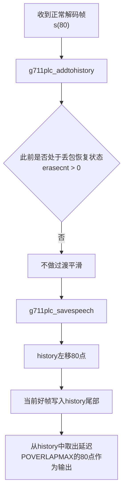
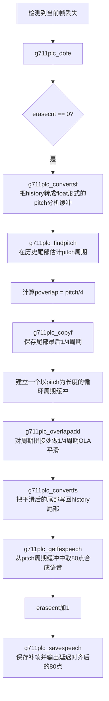
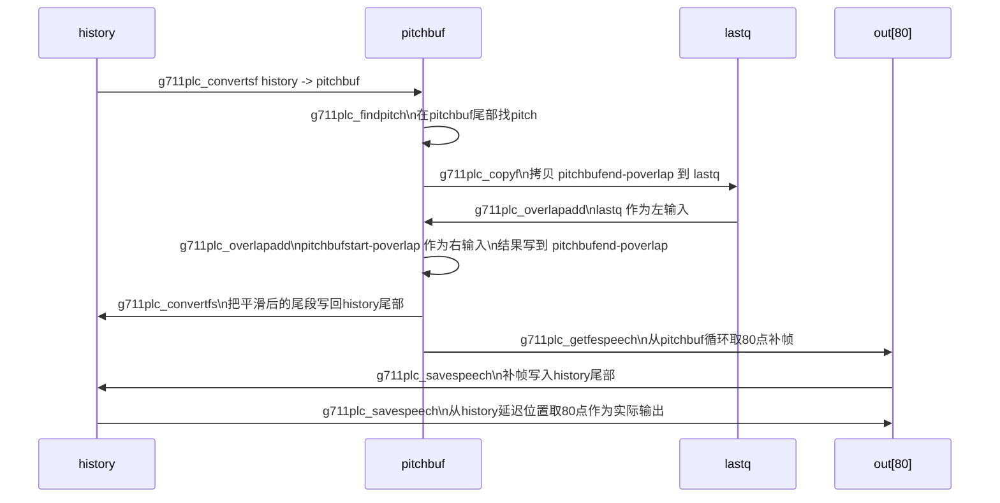
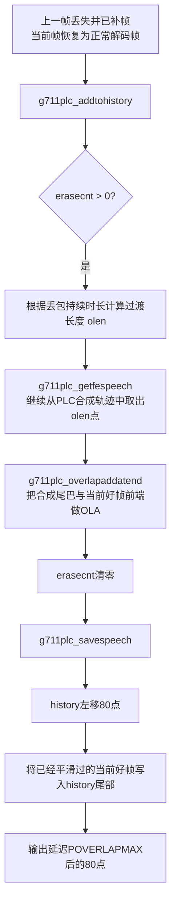

下面基于 `g711iplc` 的 `main / g711plc_addtohistory / g711plc_dofe` 代码，总结三类流程图：

1. **正常帧支路**
2. **丢一帧补帧支路**
3. **从丢帧回到正常帧的过渡支路**
---

# 1. 总体流程图

# 2. 丢一帧再恢复的流程图
## 2.1 正常帧
如果此前没有发生丢包，erasecnt=0, 那么
不需要做PLC合成
不需要synthetic-->good frame的过渡
收到正常解码帧后，addtohistory，
再从history中去除延迟后的输出，延迟为30ms
### 2.1.1 流程图



## 2.1.2 函数详解
savespeech
按照lowFE.h代码定义，history buffer大小是390个short
```
PITCH_MAX   = 120
POVERLAPMAX = PITCH_MAX >> 2 = 30
HISTORYLEN  = PITCH_MAX * 3 + POVERLAPMAX
            = 120 * 3 + 30
            = 390
```
1. 先把 history 左移 80 点
2. 把当前这一帧写到 history[310 ... 389]
3. 再从 history[280 ... 359] 取 80 点作为实际输出
history 是一个 390 点滑动窗口，外部输出永远比内部状态 延迟 30 点
## 2.2 丢一帧补帧
### 2.2.1 流程图
丢一帧的补帧流程如下

### 2.2.2 buffer 读写时序
history 是系统的正式时域历史缓存，也是最终输出历史；pitchbuf 是从 history 派生出的 float 工作缓冲区，用于 pitch 分析、拼接平滑和补帧生成；lastq 则是 pitchbuf 尾部一小段的临时备份缓冲。




### 2.2.3 函解释与buffer地址
g711plc_convertsf
读取history的short数据转成float，写入pitchbuf中，便于后面做pitch相关的计算和overlapadd

g711plc_findpitch
在pitchbufend找一个最优pitch周期
本质上是基于从history中搬过来的数据，找到最像一个周期重复的长度。

g711plc_copyf
把pitchbufend最后poverlap=pitch/4的那段保存到lastq，作为平滑拼接的左侧，lastq相当于起了temp的作用，因为后续会将pitchbufend指针作为输出指针，会被写到。

g711plc_overlapadd
将以下数据做一次OLA，目的是把“当前历史尾巴”平滑过渡到“下一个要复制出来的周期初始部分”

设
* E = pitchbufend
* P = pitch
拼接波形buffer如下
E-P-poverlap     E-P                 E-poverlap                           E
|-----------------|-------------------|-----------------------|
   右侧输入 r         被选中的 pitch 周期      原始历史尾巴 lastq
* 输入左侧：lastq，即pitchbufend最后1/4周期
* 输入右侧：pitchbufstart
* 输出：输出放在pitchbufend

g711plc_convertfs
将pitchbufend的数据，同步会history的尾部

g711plc_getfespeech
生成一帧80点的补帧，放入out

g711plc_savespeech
把这帧补出来的80点存入history，并输出延迟对齐后的80点。

第一个丢包补偿的输出组成如下
```
(POVERLAPMAX - poverlap)
+
poverlap
+
(FRAMESZ - POVERLAPMAX)
```
假设pitch＝80，则poverlap=80>>2=20，组成如下
|----10----|----20----|-------------50-------------|
旧历史      overlap平滑      PLC周期复制
### 2.2.4 findpitch的疑问
1. poverlap为什么是估计出来的pitch右移两位?
如果overlap太短，比如只取几个samples，对准周期语音信号来说，一个周期内部波形是有结构的，要让“历史尾部”过渡到“合成尾部”，需要覆盖一小段有意义信号。如果只取固定samples，比如10个sample，对于pitch=40，10对应1/4周期，对于pitch＝120，10对应1/12周期，平滑力度完全不一致，所以需要和pitch相关。

## 2.3 恢复到正常帧
### 2.3.1 流程图
这时主流程不再走 g711plc_dofe，而是重新走 g711plc_addtohistory，但它内部会先做一次 synthetic → real 的过渡平滑。

### 2.3.2 buffer读写时序

### 2.3.3 函数详解与buffer地址
前面经历过丢帧，不能把当前好帧直接接上去，容易出现相位突变，听感上出现杂音。所以需要先做以下两步：
g711plc_getfespeech
不是直接放弃PLC，而是继续沿着上一帧补包时的数据，再往前取一小段synthetic speech tail

g711plc_overlapaddatend
把这段synthetic tail和当前真实好帧的前端做OLA，于是过渡区变成：
* 前半部分更接近synthetic
* 后半部分逐渐过渡到真实好帧
```
POVERLAPMAX (PLC continuation)
+
poverlap(PLC↔speech overlap)
+
framez - POVERLAPMAX - poverlap(decoded speech)

|-----30-----|----20----|------30------|

PLC tail      crossfade     normal speech
```
## 2.4总结

总结下来就是
丢帧时：先估计 pitch，并在周期拼接处做一次 overlapadd
恢复时：再把 synthetic 尾巴和第一帧好帧做一次 overlapaddatend
最终都通过savespeech来更新

# 3. plc和mSBC的结合
当前问题在于从PLC到正常解码的第一帧，对于425Hz的单频信号
pitch=
poverlap = 
POVERLAPMAX ＝ 
framez = 120
第一帧结构如下
```
POVERLAPMAX (PLC continuation)
+
poverlap(PLC↔speech overlap)
+
framez - POVERLAPMAX - poverlap(decoded speech)
|------30------|----20----|------30------|
PLC tail       crossfade   normal speech
```
